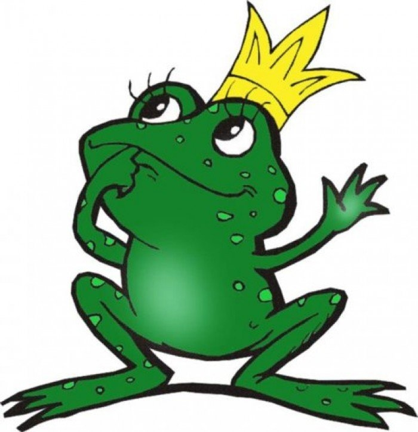

# Легу шечь ка!

Telegram-бот для чатиков: легушька квакает, передразнивает, играет кушает еду и
болтает случайными репликами. Написан на [aiogram 3](https://docs.aiogram.dev/), состояние хранится в SQLite.

## Требования

- Python 3.10+
- Токен бота от [@BotFather](https://t.me/BotFather)

## Установка

```bash
git clone https://github.com/Rescor/legushka
cd legushka
python3 -m venv venv

# Linux / macOS
./venv/bin/python -m pip install -r requirements.txt

# Windows (PowerShell)
.\venv\Scripts\python.exe -m pip install -r requirements.txt

# Windows (Git Bash)
./venv/Scripts/python.exe -m pip install -r requirements.txt
```

## Настройка Telegram-бота

1. Создай бота через [@BotFather](https://t.me/BotFather) (`/newbot`) и получи токен.
2. **Отключи Privacy Mode**: `/mybots` → выбери бота → **Bot Settings** →
   **Group Privacy** → должно быть **Disabled**. Без этого бот в группах
   видит только сообщения, адресованные ему напрямую (команды, реплаи,
   упоминания), и не сможет ловить «ква» и прочее в обычных сообщениях.
3. Добавь бота в нужные чаты.

## Настройка `.env`

Скопируй `.env.example` в `.env` и заполни:

```bash
cp .env.example .env
```

| Переменная             | Что это                                                                                                             |
| ---------------------- | ------------------------------------------------------------------------------------------------------------------- |
| `BOT_TOKEN`            | токен от BotFather                                                                                                  |
| `INITIAL_FRIEND_ID`    | твой Telegram user ID - Буся сделает тебя другом при каждом старте и защитит от бана/разжалования через `Буся, бан` |
| `OWNER_CONTACT`        | кого Буся просит написать, если чат ещё не доверенный (например, `@username`)                                       |
| `LOG_LEVEL`            | уровень логов: `DEBUG`/`INFO`/`WARNING`/`ERROR` (по умолчанию `INFO`)                                               |
| `STICKER_SET_NAME`     | короткое имя стикерпака для «дай жабу» (по умолчанию `Busyastickerset`)                                             |
| `NAME_ALIASES`         | имена через запятую, на которые откликается Буся (по умолчанию `буся,легушька`)                                     |
| `EDIT_WARNING_ENABLED` | предупреждение о редактировании старых сообщений - выключено по умолчанию (`false`), см. ниже почему                |

Свой Telegram ID можно узнать, написав боту [@userinfobot](https://t.me/userinfobot).

## Запуск

```bash
# Linux / macOS
./venv/bin/python bot.py

# Windows (PowerShell)
.\venv\Scripts\python.exe bot.py

# Windows (bash)
./venv/Scripts/python.exe bot.py
```

В логах должно появиться `Вошла как @имя_бота...`. Останавливается через `Ctrl + C`.

## Доверенные чаты

Список доверенных чатов хранится в базе данных (`data/legushka.db`).
**Пока список пуст, Буся не доверяет ни одному чату**: «ква», «квакни»,
«дай жабу» и передразнивание ответов работают всегда и везде, а вот
на остальные команды (`кушай`, `кто я`, `сколько весишь` и т.д.) в
недоверенных чатах Буся отвечает отказом и просит написать `OWNER_CONTACT`.

Чтобы начать доверять чату - напиши в нём (только `INITIAL_FRIEND_ID` может это сделать):

```
Буся, доверяй
```

Без ID - доверяет тому чату, где это написано. Можно указать и ID чата,
если команду пишешь не в целевом чате:

```
Буся, доверяй -1001234567890
```

Обратная команда - `Буся, не доверяй [id]`.

Если не знаешь ID чата - просто напиши в нём что угодно, Буся один раз
за запуск залогирует его название и ID в консоль (это подсказка, не
команда - сама Буся на это сообщение не отреагирует).

## Команды

Обращаться к Бусе можно по любому из имён: **Буся**, **Легушька** (список
задан переменной `NAME_ALIASES` в `.env`).

### Работают везде, без доверия чату

| Фраза                          | Что делает                                            |
| ------------------------------ | ----------------------------------------------------- |
| `ква` (где угодно в сообщении) | отвечает «Ква!»                                       |
| `квакни`                       | присылает голосовое с кваком                          |
| `дай жабу`                     | присылает стикер жабы                                 |
| ответ на сообщение Буси        | передразнивает, жабофицируя каждое слово              |
| —                              | иногда (случайно) квакает или говорит случайную фразу |

### Все остальные "<имя>, ..." команды работают только в доверенных чатах

В недоверенном чате на любую из них Буся отвечает отказом и просьбой написать `OWNER_CONTACT`.

| Команда                                            | Что делает                                             |
| -------------------------------------------------- | ------------------------------------------------------ |
| `<имя>, кто я`                                     | говорит, кто ты для неё                                |
| `<имя>, сколько ты весишь`                         | текущий вес Буси                                       |
| `<имя>, кушай <еда>`                               | покормить                                              |
| `<имя>, что ты ешь`                                | топ-10 самых частых угощений                           |
| `<имя>, любимая еда`                               | топ-10 самых питательных угощений                      |
| `<имя>, хватит реагировать на изменение сообщений` | выключить предупреждения о правках (только админ чата) |
| `<имя>, реагируй на изменение сообщений`           | включить обратно (только админ чата)                   |

**Предупреждение о редактировании старых сообщений по умолчанию выключено
целиком** - переменная `EDIT_WARNING_ENABLED=false`. Причина: Telegram
шлёт один и тот же тип апдейта (`edited_message`) и на настоящую правку
текста, и на реакцию на старое сообщение - отличить одно от
другого нельзя (это особенность Bot API, а не баг бота), так
что Буся неизбежно волнуется и шумит ложными срабатываниями на реакции. Команды
`хватит/реагируй на изменение сообщений` работают только если
`EDIT_WARNING_ENABLED=true` - иначе Буся вообще не подписана на `edited_message`
и их переключать не на что.

### Команды дружбы

Команды дружбы дополнительно (уже внутри доверенного чата) требуют, чтобы
**отправитель** был другом (список хранится в базе данных, начинается пустым):

| Команда                                    | Что делает                                 |
| ------------------------------------------ | ------------------------------------------ |
| `<имя>, память`                            | сколько памяти занимает процесс бота       |
| `<имя>, фас` (ответом на чьё-то сообщение) | присылает Telegram ID автора               |
| `<имя>, дружи` (ответом)                   | Буся начинает дружить с автором сообщения  |
| `<имя>, бан` (ответом)                     | Буся перестаёт дружить с автором сообщения |

### Команды владельца

Доступны только для `INITIAL_FRIEND_ID` из `.env` - он же единственный,
кто может управлять доверенными чатами. Он назначается автоматически
при каждом старте бота и защищён от бана.

| Команда                  | Что делает                                               |
| ------------------------ | -------------------------------------------------------- |
| `<имя>, доверяй [id]`    | добавить чат в доверенные (без id - текущий)             |
| `<имя>, не доверяй [id]` | убрать чат из доверенных                                 |
| `<имя>, выплюнь <еда>`   | удалить еду из базы (если кто-то покормил Бусю гадостью) |

## Свой стикерпак

Буся использует стикерпак `Busyastickerset` (переменная `STICKER_SET_NAME`
в `.env`). Если хочешь, чтобы Буся отправляла твой стикер - возьми короткое имя стикерпака из ссылки `t.me/addstickers/<имя>` и замени на своё.

## Структура проекта

```
legushka/
├── bot.py          # точка входа
├── config.py       # константы, читает .env
├── db.py           # SQLite база данных: друзья/враги, доверенные чаты, кормление
├── chat_access.py  # проверка доверенных чатов
├── commands.py     # "<имя>, ..." команды
├── reactions.py    # ква/квакни/дай жабу/передразнивание/случайные реплики
├── edited.py       # предупреждение о редактировании старого сообщения
├── morphology.py   # жабофикация слов и согласование фраз
├── state.py        # состояние в памяти (id бота, последние сообщения)
└── assets/         # аватар и аудио для "квакни"
```

## Благодарности

Спасибо [OverwhelmingFire](https://github.com/OverwhelmingFire) и [EvgenZhaba](https://t.me/evgenzhaba) за оригинальную идею Буси.

Исходный проект (первая версия Буси) лежит тут: [OverwhelmingFire/ZhabkaBusyaBot](https://github.com/OverwhelmingFire/ZhabkaBusyaBot).
Этот репозиторий - полностью переписанная версия, но личность Буси и идея унаследованы оттуда.

## Ква! 🐸


